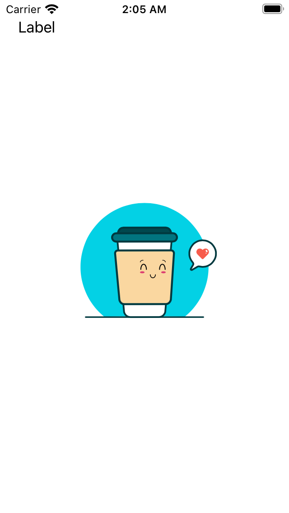

## Exemplo Lottie via Carthage

um exemplo bem mongol de como usar carthage pra mostrar um Lottie na tela

## Como faz

pasta do projeto, rodar um `brew install carthage`
depois, criar um arquivo Cartfile: `touch Cartfile`
adicionar nele o projeto referencia que você quiser, vindo github ou afins.
então rodar um:`carthage update --plaform iOS --use-xcframework`
depois de esperar varios minutos, ir na pasta `Cartage/Build` e arrastar o arquivo xcframework gerado para dentro do Xcode, no `Framewoks, Libraries, and Embedded Content`
É nois que voa

## tela

